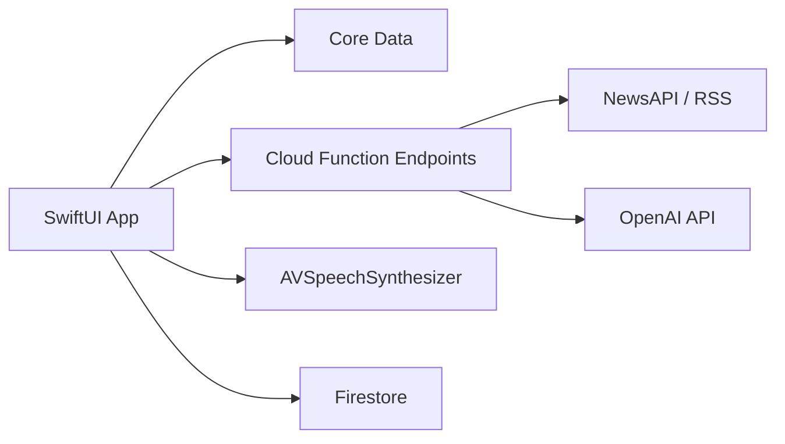

## 1. Project Overview

**App Name:** Idioma

**Purpose:** Region-specific information hub including news articles simplified by an LLM to aid language learners in reading, listening, and comprehension.

---

## 2. Objectives

- Onboard users quickly with minimal friction
- Fetch and display region-specific news
- Simplify articles to adjustable reading levels (A2–C1)
- Provide vocabulary tools (definitions, flashcards)
- Support audio playback and recording for pronunciation practice
- Track learning progress and engagement metrics

---

## 3. Scope & Deliverables

### In Scope (MVP)

- User onboarding & region selection
- News fetcher & caching
- Article list and detail views
- One‑tap simplify (LLM integration)
- Original ↔ Simplified toggle
- Local caching (Core Data)
- Basic vocabulary lookup
- TTS playback for simplified text

### Out of Scope (Phase 2+)

- Social features (leaderboards, comments)
- Classroom/teacher dashboards
- Advanced quizzes and SRS flashcard system
- Android or web client versions

---

## 4. Technology Stack

To implement each feature efficiently, here’s a breakdown of the main technologies and services:

| Feature Area                     | Client‑side (iOS)                                   | Backend / Services                                       |
| -------------------------------- | --------------------------------------------------- | -------------------------------------------------------- |
| **UI & State Management**        | Swift + SwiftUICombine / async‑await                | —                                                        |
| **Networking & API Layer**       | URLSession (dataTaskPublisher)Codable models        | Firebase Cloud Functions (Node.js)Express/REST endpoints |
| **User Auth & Preferences**      | Firebase Auth iOS SDK (Google Login)Keychain        | Firebase AuthFirestore (user prefs)                      |
| **News Fetch & Cache**           | Core Data (cached articles)@FetchRequest            | Cloud Function scheduled fetch (NewsAPI/RSS)             |
| **Article Simplification**       | —                                                   | Cloud Function → OpenAI Chat Completions API             |
| **Search & Summarization**       | —                                                   | Cloud Function → Wikipedia REST + OpenAI API             |
| **In‑Line Lookup & Translation** | iOS Dictionary APITextKit for lookup UI             | —                                                        |
| **Complexity Scoring**           | Swift logic + custom scoring algorithm in ViewModel | —                                                        |
| **Contextual Quizzes**           | SwiftUI quiz viewsCombine for state                 | Cloud Function to generate quiz items (optional)         |
| **Vocabulary & Flashcards**      | Core Data / @AppStorage for deckSwiftUI lists       | Firestore (sync across devices)                          |
| **Audio & Pronunciation**        | AVFoundation (AVSpeechSynthesizer)Speech framework  | —                                                        |
| **Offline Mode & Storage**       | Core Data + FileManager (audio files)               | —                                                        |
| **Push Notifications & Widgets** | UserNotifications + WidgetKit                       | Firebase Cloud Messaging (APNs)                          |
| **Analytics & Monitoring**       | Firebase Analytics SDKSentry iOS SDK                | Firestore logs, Sentry alerts                            |
| **CI/CD & Infrastructure**       | Xcode Cloud / GitHub ActionsFastlane                | Firebase CLI / Terraform for IaC                         |

This stack ensures:

- **Performance & UX:** Native SwiftUI delivers smooth animations and tight OS integration.
- **Scalability:** Serverless Cloud Functions scale automatically for news fetching, LLM calls, and search.
- **Rapid Iteration:** Combine/async‑await and Firebase accelerate development of new features.
- **Maintainability:** Clear separation of concerns between client‑side logic and backend services.

---

## 5. Architecture Overview. Architecture Overview

---

## 6. Feature Breakdown

1. **User Onboarding & Authentication**
   - Google Login (Firebase Auth) with optional social logins
   - Securely store account info and user preferences
2. **Dashboard (Personalized Landing Page)**
   - Modular tiles displaying articles based on selected region, topics, and reading level
   - Quick access to recently simplified articles and flashcards
3. **News Pipeline**
   - Scheduled function fetches region-specific news hourly
   - Cache headlines, full text, and metadata in Core Data
4. **Reading UI**
   - Article list with pull-to-refresh and infinite scroll
   - Detail view with Original ↔ Simplified toggle and complexity score indicator
5. **One‑Tap Simplify & Comprehension Levels**
   - HTTP call to Cloud Function that wraps OpenAI API
   - Adjustable reading levels (A2–C1)
6. **Search Page**
   - Search across Wikipedia topics
   - Summarize or simplify results via LLM
   - Toggle output language and difficulty level
   - Store and display most recently searched terms
7. **Vocabulary & In‑Line Tools**
   - Tap a word for definition, translation, pronunciation (iOS Dictionary API)
   - Add tapped words to flashcard deck for spaced-repetition review
8. **Contextual Quizzes**
   - Auto-generate multiple-choice or fill-in-the-blank questions per article
   - Quiz UI with instant feedback and score tracking
9. **Audio & Pronunciation Practice**
   - Dual TTS playback (original vs. simplified) with speed controls
   - Voice recording feature for pronunciation self-evaluation
10. **Offline Mode & Storage**
    - Save last 5–10 articles (full and simplified text plus audio) for offline use
    - Smart cache cleanup after configurable period

---

## 7. Development Phases & Timeline

Below is the recommended sequence, balancing backend-first setup with iterative frontend integration and feature rollout. Each phase combines both ends to allow parallel work when possible.

| Phase                                 | Duration | Priority & Focus                                                                                                                                                                                                                                                                                                                                                                                   |
| ------------------------------------- | -------- | -------------------------------------------------------------------------------------------------------------------------------------------------------------------------------------------------------------------------------------------------------------------------------------------------------------------------------------------------------------------------------------------------- |
| **Phase 0: Setup**                    | 1 week   | - **Infrastructure**: configure Firebase project, Cloud Functions CI, Firestore rules, Core Data schema- **Repo & CI/CD**: initialize Git repo, configure Xcode Cloud/GitHub Actions, Fastlane testflight- **API Contracts**: design and document REST endpoints for news fetcher, simplify, search, auth- **Skeleton App**: empty SwiftUI project with navigation structure and placeholder views |
| **Phase 1: Core Backend Services**    | 2 weeks  | - **News Fetcher Function**: implement scheduled fetch from NewsAPI/RSS, store in Firestore- **Simplify Function**: wrap OpenAI Chat Completions, test sample calls- **Auth**: enable Google Login via Firebase Auth- **API Testing**: unit tests for each endpoint, mock responses                                                                                                                |
| **Phase 2: MVP Frontend Integration** | 2 weeks  | - **Authentication & Onboarding UI**: implement Google Login flow and region select- **Article List & Detail**: fetch from news API endpoint, display headlines and placeholders- **Simplify Action**: wire up “Simplify” button to call simplify endpoint, show loading and results- **Core Data Caching**: save and load articles locally for offline fallback                                   |
| **Phase 3: Core UX Enhancements**     | 2 weeks  | - **Original ↔ Simplified Toggle** and **Complexity Score** in detail view- **Pull-to-Refresh** and **Infinite Scroll** in article list- **Dashboard Module**: basic tiles for recent & recommended articles                                                                                                                                                                                       |
| **Phase 4: Vocabulary & Audio**       | 2 weeks  | - **In-Line Lookup**: integrate iOS Dictionary API for tap-to-define/translate- **Flashcards Storage**: allow adding words to local deck (Core Data / Firestore sync)- **TTS Playback**: implement AVSpeechSynthesizer for simplified text with speed controls- **Voice Recording**: basic record/replay UI for pronunciation practice                                                             |
| **Phase 5: Search & Quizzes**         | 2 weeks  | - **Search Page**: integrate Wikipedia REST, wire summarization endpoint, recent searches list- **Adjustable Language & Level Toggle** in search results- **Contextual Quizzes**: call optional quiz-generation endpoint, build quiz UI and scoring logic                                                                                                                                          |
| **Phase 6: Offline & Notifications**  | 1 week   | - **Offline Mode**: auto-save last N articles + audio, cache cleanup logic- **Widgets & Push**: build a WidgetKit top-3 headlines widget and schedule FCM notifications                                                                                                                                                                                                                            |
| **Phase 7: Polish & QA**              | 2 weeks  | - **UI/UX Tweaks**: refine animations, accessibility checks, Dark Mode support- **Automated Testing**: full unit, UI, and integration tests (XCTest/XCUITest)- **Beta Feedback**: gather TestFlight user input, fix critical bugs                                                                                                                                                                  |
| **Phase 8: Launch & Monitoring**      | 1 week   | - **App Store Submission**: finalize metadata, screenshots, localized descriptions- **Monitoring**: enable Sentry alerts, configure Firebase Analytics dashboards                                                                                                                                                                                                                                  |

> **Backend vs. Frontend Approach:**
>
> 1. **Backend-First for Core Services**: Build and test news fetcher, LLM simplify, auth endpoints early so frontend has reliable APIs to integrate against.
> 2. **Parallel Frontend Work**: As APIs stabilize, frontend can scaffold UI and wire features incrementally, reducing blocking waits.
> 3. **Iterative API Expansion**: When adding features like quizzes or search, define and implement corresponding endpoints just ahead of the UI integration.

---

## 8. Roles & Responsibilities Roles & Responsibilities

- **Product Owner:** Define features, prioritize backlog
- **iOS Engineer:** Implement SwiftUI app, local storage
- **Backend Engineer:** Cloud Functions, LLM integration
- **QA Engineer:** Test plans, automated tests, bug tracking
- **UX/UI Designer:** Wireframes, user flows, accessibility

---

## 9. Testing & Quality Assurance

- **Unit Tests:** ViewModels, network layer, parsing
- **UI Tests:** SwiftUI snapshots, navigation flows
- **Integration Tests:** End-to-end simplify pipeline
- **Beta Testing:** Distribute via TestFlight for real-world feedback

---

## 10. Deployment Strategy

- **CI Pipeline:** Push → build → tests → archive → TestFlight
- **App Store:** Prepare metadata, screenshots, localized descriptions
- **Monitoring:** Sentry for crashes, Firebase Analytics for usage

---

## 11. Maintenance & Monitoring

- **Crash Alerts:** Sentry email/push notifications
- **Usage Dashboards:** Key metrics (DAU, simplify requests)
- **Feedback Loop:** In-app feedback form, app reviews

---

## 12. Risks & Mitigations

| Risk                                   | Mitigation                                 |
| -------------------------------------- | ------------------------------------------ |
| LLM latency under load                 | Implement caching, show progress indicator |
| API key exposure in client             | Keep keys in Cloud Functions               |
| Content copyright/licensing concerns   | Only fetch RSS or public domain sources    |
| SwiftUI limitations on complex layouts | Fallback to UIKit for edge cases           |

---

## 13. Next Steps

1. Finalize requirements and user stories
2. Set up project repository and CI/CD
3. Prototype onboarding & news list UI
4. Build and test LLM simplify function
5. Kick off MVP development with weekly demos
